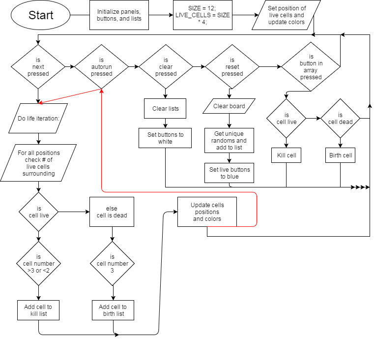

# GameOfLife
<h2>This project was based on <a href="https://en.wikipedia.org/wiki/Conway%27s_Game_of_Life">Conway's Game of Life</a></h2>
 
<h2>What is this Project</h2>

This project was done for a java class that we took. We were tasked to make application making use of available graphics and to make it look nice. We decided to base our project off of a previously done project called Conway's Game of Life. This "game" is more of a simulation to roughly simulate life.

<h2>Game Rules</h2>

The rules for the game are fairly simple and are as follows. These are the rules shown on the wikipedia page for Conway's Game of Life

<ol>
<li>Any live cell with fewer than two live neighbours dies, as if caused by underpopulation.</li>
<li>Any live cell with two or three live neighbours lives on to the next generation.</li>
<li>Any live cell with more than three live neighbours dies, as if by overpopulation.</li>
<li>Any dead cell with exactly three live neighbours becomes a live cell, as if by reproduction.</li>
</ol>

<h3>Videos Showing Examples of this Project</h3>
<ul>
<li> <a href ="https://youtu.be/W3y0SwyUBA8">Video One</a> </li>
<li> <a href ="https://youtu.be/jo_sbVWMhao">Video Two</a> </li>
</ul>

